<h1 align="center">Hello, 你好! 👋 这里是 Puiching-Memory</h1>
<h3 align="center">@梦归云帆</h3>

  

---

<!-- GitHub Stats & Top Langs 並排 -->

  

<!-- Profile Summary Cards -->

 

<!-- Language Analysis 並排 -->

 

<h3 align="center">🛠 Tech Stack</h3>

  <b>Languages & Core:</b> Python, C++, Cython 
  <b>AI & Deep Learning:</b> PyTorch, LLM/SD Fine-tuning, Agent Workflow, YOLO, VLM 
  <b>Dev & Ops:</b> Docker, Git, ECS, Electron, FastAPI, QT

<h3 align="center">🎓 Education</h3>

  <b>Guangdong Polytechnic Normal University (广东技术师范大学)</b> 
  B.E. in Network Engineering (网络工程) | 2023 - 2027 
  <i>Qualifications: CET-4 | Driving License C2</i>

<h3 align="center">💼 Experience</h3>

- **R&D Intern @ Desay SV (德赛西威 002920.SZ)** `2024.07 - 2024.09`
  - Developed traffic sign detection system based on **YOLOv5**, extended for multi-label classification (40+ classes).
  - Built End-to-end Driving Agent using **VLM** with LoRA fine-tuning and automated data pipelines.
  - Implemented 2D/3D Monocular Lane Detection models and MonoDLE based 3D Object Detection.

<h3 align="center">🚀 Selected Projects</h3>

- **MonoLite** `2024.09 - Present`
  - Monocular 3D Object Detection System with modular architecture.
  - Implemented custom **OPT caching** and **Cython** acceleration for performance optimization.
  - Open Source: [GitHub](https://github.com/Puiching-Memory/monolite)

- **PRfire (Smart Agriculture System)** `2024.10 - 2025.03`
  - Backend development using **FastAPI** & **Docker**, integrated **VLM** & **YOLO** for disease detection.
  - 3D Terrain Reconstruction using **COLMAP** + OpenMVS.
  - Open Source: [GitHub](https://github.com/Puiching-Memory/PRfire)

- **FakeBrain (BCI Game Backend)** `2025.03 - 2025.05`
  - Brain-Computer Interface backend using **C++** & **Qt**.
  - **LSTM** based blink detection deployed via **ONNX Runtime**.
  - Game agent training pipeline with VLM.
  - Open Source: [GitHub](https://github.com/Puiching-Memory/fakebrain)

<h3 align="center">🏆 Honors & Awards</h3>

| Award                                                 | Rank/Level           | Year |
| :---------------------------------------------------- | :------------------- | :--- |
| **Tencent Game Algo Competition (Text2SQL)**          | 54th                 | 2025 |
| **"Challenge Cup" Competition (AI+ Track)**           | 33rd                 | 2025 |
| **Chinese Collegiate Computer Design Contest**        | Provincial 3rd Prize | 2023 |
| **National Undergraduate Electronics Design Contest** | Provincial 3rd Prize | 2025 |
| **Lanqiao Cup (Python Track)**                        | Provincial 3rd Prize | 2023 |

<h3 align="center">🌟 Community</h3>

  <b>SwanLab Community Contributor</b> 
  <i>Active Contributor [ 4 commits | 173++ | 142-- | #10 ]</i>

<h3 align="center">📄 Publications</h3>

- **Zhang Kai**, et al. (2025). *Research on Narrowband Satellite IoT Video Transmission Technology Based on an Optimized AVS3 Model*. IEEE IoTAAI Conference. (4th Author)

 

Last edit in 2026.02.08

